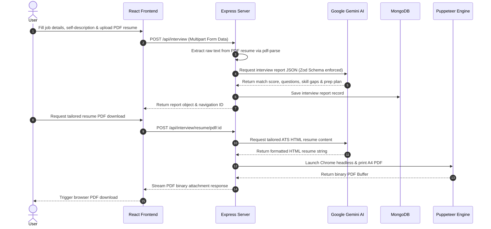

# 🚀 YT-GENAI — AI-Powered Interview Preparation & Resume Customization Platform

A full-stack, AI-driven platform designed to supercharge your interview preparation and job search strategy. By leveraging **Google Gemini AI**, **Puppeteer**, **Node.js**, and **React**, this application analyzes candidate resumes against job descriptions to generate comprehensive interview reports, targeted technical/behavioral question guides, custom skill-gap analyses, day-by-day study plans, and tailored ATS-friendly PDF resumes.

---

## 📑 Table of Contents

- [Features](#-features)
- [Tech Stack](#-tech-stack)
- [Project Architecture & Directory Structure](#-project-architecture--directory-structure)
- [API Documentation](#-api-documentation)
  - [Authentication Routes (`/api/auth`)](#1-authentication-routes-apiauth)
  - [Interview Routes (`/api/interview`)](#2-interview-routes-apiinterview)
- [Environment Variables](#-environment-variables)
- [Installation & Setup](#-installation--setup)
  - [Prerequisites](#prerequisites)
  - [Backend Setup](#backend-setup)
  - [Frontend Setup](#frontend-setup)
- [Application Workflow](#-application-workflow)
- [Contributing & License](#-contributing--license)

---

## ✨ Features

- 🔐 **Secure User Authentication**: Complete user registration, login, logout, cookie-based JWT sessions, and server-side token blacklisting middleware.
- 📄 **PDF Resume Parsing**: Upload PDF resumes directly; text is extracted seamlessly using `pdf-parse`.
- 🧠 **AI-Powered Match & Gap Analysis**:
  - **Match Score**: 0–100% profile compatibility score for the target job description.
  - **Technical & Behavioral Questions**: Generates expected interview questions, interviewer intention, and strategic response advice.
  - **Skill Gap Detection**: Highlights missing or weak skills categorized by severity (`low`, `medium`, `high`).
  - **Structured Preparation Plan**: A customized day-by-day study schedule with actionable daily tasks.
- 📑 **Tailored Resume PDF Generation**:
  - Uses Gemini AI to draft professional, ATS-friendly HTML resumes tailored for specific job listings.
  - Converts HTML dynamically into styled A4 PDF documents using **Puppeteer** for instant download.
- 📊 **Interview Dashboard & History**: Save and review all past interview reports and generated resumes at any time.

---

## 🛠️ Tech Stack

### **Backend**
| Technology | Description |
| :--- | :--- |
| **Node.js & Express.js** | Server-side environment and RESTful API router (Express v5) |
| **MongoDB & Mongoose** | NoSQL database for managing users, reports, and token blacklists |
| **Google GenAI SDK** | Gemini 3 Flash model integration for structured content generation |
| **Zod & Zod-to-JSON-Schema** | Strict schema validation for AI response formatting |
| **Puppeteer** | Headless Chrome browser engine for HTML-to-PDF rendering |
| **PDF-Parse** | PDF text extraction engine |
| **JWT & BcryptJS** | Secure password hashing and cookie-based JWT authorization |
| **Multer** | Multipart form data upload handler for PDF resumes |

### **Frontend**
| Technology | Description |
| :--- | :--- |
| **React 19** | UI library for single-page application development |
| **Vite** | Lightning-fast frontend build tool and dev server |
| **React Router v7** | Client-side routing and page navigation |
| **SCSS / Sass** | Modular and styled component design |
| **Axios** | HTTP client for backend API interaction |

---

## 📁 Project Architecture & Directory Structure

```
YT-GENAI/
├── .env                  # Environment variables configuration
├── package.json          # Root/Backend package dependencies & scripts
├── server.js             # Express application entry point
├── src/
│   ├── app.js            # Express middleware setup & router mounting
│   ├── config/
│   │   └── database.js   # MongoDB connection setup
│   ├── controllers/
│   │   ├── auth.controller.js       # Auth logic (register, login, logout, me)
│   │   └── interview.controller.js  # Report generation, PDF export, fetching
│   ├── middlewares/
│   │   ├── auth.middleware.js       # JWT validation & token blacklisting check
│   │   └── file.middleware.js       # Multer memory storage configuration
│   ├── models/
│   │   ├── blacklist.model.js       # Invalidated JWT tokens storage
│   │   ├── interviewReport.model.js # User interview reports schema
│   │   └── user.model.js            # User credentials schema
│   ├── routes/
│   │   ├── auth.routes.js           # Endpoint definitions for /api/auth
│   │   └── interview.routes.js      # Endpoint definitions for /api/interview
│   └── services/
│       └── ai.service.js            # Gemini AI prompts, Zod schemas & Puppeteer PDF generation
└── Frontend/             # React 19 Frontend application
    ├── package.json
    ├── vite.config.js
    └── src/
        ├── App.jsx
        ├── main.jsx
        ├── app.routes.jsx
        └── features/
            ├── auth/                # Auth components, context, and pages
            └── interview/           # Interview tools, context, pages, styles
```

---

## 📡 API Documentation

### 1. Authentication Routes (`/api/auth`)

| Method | Endpoint | Access | Description |
| :--- | :--- | :--- | :--- |
| `POST` | `/api/auth/register` | Public | Register a new user (`username`, `email`, `password`) |
| `POST` | `/api/auth/login` | Public | Authenticate user and receive HTTP-only token cookie |
| `GET` | `/api/auth/logout` | Public | Clear JWT token cookie and add token to blacklist |
| `GET` | `/api/auth/get-me` | Protected | Fetch current logged-in user details |

### 2. Interview Routes (`/api/interview`)

| Method | Endpoint | Access | Description |
| :--- | :--- | :--- | :--- |
| `POST` | `/api/interview/` | Protected | Generate AI report from uploaded PDF resume, `selfDescription`, and `jobDescription` |
| `GET` | `/api/interview/` | Protected | Fetch summary of all interview reports created by the user |
| `GET` | `/api/interview/report/:interviewId` | Protected | Get full detailed report by `interviewId` |
| `POST` | `/api/interview/resume/pdf/:interviewReportId` | Protected | Generate and download tailored PDF resume |

---

## ⚙️ Environment Variables

Create a `.env` file in the root directory with the following configuration:

```env
# Database Connection
MONGO_URI=mongodb+srv://<username>:<password>@cluster.mongodb.net/interview-master

# JWT Authentication
JWT_SECRET=your_super_secret_jwt_key_here

# Google Gemini AI API Key
GOOGLE_GENAI_API_KEY=your_google_gemini_api_key_here
```

---

## 🚀 Installation & Setup

### Prerequisites
- **Node.js**: v18.x or higher
- **npm**: v9.x or higher
- **MongoDB**: Local instance or MongoDB Atlas connection string
- **Google Gemini API Key**: Obtainable from [Google AI Studio](https://aistudio.google.com/)

---

### Backend Setup

1. **Clone the repository**:
   ```bash
   git clone https://github.com/Rahul-8815/YT-GENAI.git
   cd YT-GENAI
   ```

2. **Install root dependencies**:
   ```bash
   npm install
   ```

3. **Configure Environment Variables**:
   Create a `.env` file in the root directory (see [Environment Variables](#-environment-variables)).

4. **Start the Backend Server**:
   - For production / standard execution:
     ```bash
     npm start
     ```
   - For development (with auto-reload):
     ```bash
     npm run dev
     ```
   *The server will run on `http://localhost:3000`.*

---

### Frontend Setup

1. **Navigate to the `Frontend` directory**:
   ```bash
   cd Frontend
   ```

2. **Install dependencies**:
   ```bash
   npm install
   ```

3. **Start the Frontend Development Server**:
   ```bash
   npm run dev
   ```
   *The client app will run on `http://localhost:5173`.*

---

## 🔄 Application Workflow



---

## 🤝 Contributing & License

Contributions, issues, and feature requests are welcome!  
This project is licensed under the **ISC License**.
